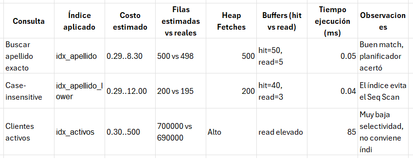

# Prácticas 2. Creación de índices B-tree 

## 🎯 Objetivos:
Al finalizar la práctica, serás capaz de:
-	Construir índices B-Tree avanzados (multicolumna, parciales y sobre expresiones) y evaluar su impacto real.
-	Diagnosticar cuándo un índice ayuda y cuándo no, usando EXPLAIN ANALYZE, estadísticas y parámetros de autovacuum.
-	Profundizar en métricas críticas (Heap Fetches, Rows Removed by Filter, Loops y Buffercache Hits).
-	Aplicar buenas prácticas de diseño de índices y demostrar problemas comunes (selectividad baja, funciones en columnas e inserciones masivas).

---

**[⬅️ Atrás](https://netec-mx.github.io/POSTSQL_ADV/Cap%C3%ADtulo1/)** | **[Lista general 🗂️](https://netec-mx.github.io/POSTSQL_ADV/)** | **[Siguiente ➡️](https://netec-mx.github.io/POSTSQL_ADV/Cap%C3%ADtulo3/)**

---

## Tarea 2.1. Creación y diagnóstico de índices B-Tree
**Paso 1.** Preparación de datos.

```sql
CREATE TABLE clientes (
    id SERIAL PRIMARY KEY,
    nombre TEXT,
    apellido TEXT,
    activo BOOLEAN,
    fecha_registro DATE DEFAULT now()
);
```

Inserta 1 millón de registros con distribución controlada.

```sql
INSERT INTO clientes (nombre, apellido, activo)
SELECT 
    md5(random()::text), 
    (ARRAY['García','López','Hernández','Martínez','Ramírez'])[floor(random()*5)+1],
    (random() < 0.7) -- 70% activos
FROM generate_series(1, 1000000);
```

> *💡 **Nota:** Con esto obtendrás una tabla grande: apellidos de baja selectividad y una columna booleana (activo) también poco selectiva.*

**Paso 2.** Índice estándar.

```sql
CREATE INDEX idx_clientes_apellido ON clientes (apellido);

Consulta de prueba:

EXPLAIN (ANALYZE, BUFFERS)
SELECT * FROM clientes WHERE apellido = 'García';
```

**👉 Observa:**
-	_Index Scan o Bitmap Index Scan._
-	_Heap Fetches:_ ¿cuántas veces tuvo que ir a la tabla después de usar el índice?

**Paso 3.** Índice multicolumna.

```sql
CREATE INDEX idx_clientes_apellido_nombre ON clientes (apellido, nombre);

Consulta de prueba:

EXPLAIN (ANALYZE, BUFFERS)
SELECT * 
FROM clientes 
WHERE apellido = 'García' AND nombre LIKE 'a%';
```

👉 Compara con el índice simple.

> *Pregunta de análisis: **¿qué mejora y qué sigue igual?***

**Paso 4.** Índice parcial.

```sql
CREATE INDEX idx_clientes_activos ON clientes (apellido)
WHERE activo = true;

Consulta de prueba:

EXPLAIN (ANALYZE, BUFFERS)
SELECT * 
FROM clientes 
WHERE apellido = 'García' AND activo = true;
```

**👉 Analiza:**
-	Diferencia en _Rows Removed by Filter_.
-	Menor número de páginas leídas vs índice normal.

**Paso 5.** Índice sobre expresión.

```sql
CREATE INDEX idx_clientes_apellido_lower ON clientes (LOWER(apellido));
```

Comparación:
- Sin índice de expresión

```sql
EXPLAIN (ANALYZE, BUFFERS)
SELECT * FROM clientes WHERE apellido = 'garcía';
```

- Con índice de expresión

```sql
EXPLAIN (ANALYZE, BUFFERS)
SELECT * FROM clientes WHERE LOWER(apellido) = 'garcía';
```

👉 Verifica cómo cambia de Seq Scan → Index Scan.

## Tarea 2. Casos donde los B-Tree NO ayudan.

**Paso 1.** Baja selectividad.

```sql
EXPLAIN (ANALYZE, BUFFERS)
SELECT * FROM clientes WHERE activo = true;
```

👉 Aunque hay un índice, PostgreSQL hará un _Seq Scan_ porque casi toda la tabla cumple la condición.

**Paso 2.** Agregación masiva
```sql
EXPLAIN (ANALYZE, BUFFERS)
SELECT COUNT(*) FROM clientes;
```
👉 Ningún índice ayuda: se necesita un Seq Scan.

**Paso 3.** Inserciones masivas y page splits.

- Índice con fillfactor para optimizar inserciones.

```sql
CREATE INDEX idx_clientes_fecha_registro
ON clientes (fecha_registro) WITH (fillfactor = 70);
```

- Simulación de inserciones diarias

```sql
INSERT INTO clientes (nombre, apellido, activo, fecha_registro)
SELECT md5(random()::text), 'Nuevo', true, now()
FROM generate_series(1,100000);
```

👉 Usa pg_stat_all_indexes para observar crecimiento y validación de page splits.

## Tarea 3. Interpretación avanzada con EXPLAIN.

**Paso 1.** Métricas críticas.

- Ejecuta una consulta con BUFFERS y analiza:

```sql
EXPLAIN (ANALYZE, BUFFERS)
SELECT * FROM clientes WHERE apellido = 'Ramírez';
```

**👉 Interpreta:**
-	Heap Fetches: ¿el índice está accediendo demasiado a la tabla? → considerar índices covering.
-	Rows Removed by Filter: ¿el índice devuelve demasiados falsos positivos? → usar parcial.
-	Buffers: cache hits vs lecturas desde disco.

**Paso 2.** Índices covering (INCLUDE).

```sql
CREATE INDEX idx_clientes_apellido_include ON clientes (apellido) INCLUDE (nombre);
Consulta:
EXPLAIN (ANALYZE, BUFFERS)
SELECT apellido, nombre FROM clientes WHERE apellido = 'López';
```

👉 Observa cómo ya no necesita Heap Fetches.

## Tarea del capítulo:

1.	Diseña un set de consultas frecuentes (por ejemplo: búsquedas por apellido, búsquedas por clientes activos, búsquedas case-insensitive).
2.	Crea diferentes tipos de índices (estándar, multicolumna, parcial, expresión, covering).
3.	Mide el impacto con EXPLAIN (ANALYZE, BUFFERS) y documenta:
    -	Costos estimados vs reales.
    -	Accesos al heap.
    -	Páginas leídas desde disco.
    -	Diferencia en tiempo de ejecución.

### 📋 Guía de Interpretación de EXPLAIN (Checklist Experto)
Cuando ejecutes:

```sql
EXPLAIN (ANALYZE, BUFFERS)
SELECT ...;
```

Tendrás salida con estimaciones y resultados reales. Interprétala así:

**1. Tipo de operación**
-	Seq Scan → PostgreSQL lee toda la tabla.
➝ Útil si no hay índices o la selectividad es muy baja.
-	Index Scan → usa el índice y va al heap por cada fila.
➝ Puede generar muchos Heap Fetches.
-	Bitmap Index Scan → el índice devuelve posiciones de páginas, se agrupan y luego se leen en bloque.
➝ Eficiente para condiciones que devuelven muchas filas.

✔️ Pregunta: **¿En el ejercicio, el plan usó un índice cuando esperabas?**

**2. Costos estimados**
Cada operación tiene: `(cost=0.29..8.30 rows=5 width=64)`.
-	0.29 → costo de inicio (primer fila).
-	8.30 → costo total estimado.
-	rows=5 → filas estimadas.
-	width=64 → tamaño medio de cada fila (bytes).

✔️ Pregunta: **¿La estimación de filas (rows) se acerca a la realidad?** Si no, revisar estadísticas con ANALYZE.

**3. Resultados reales**

Ejemplo: `(actual time=0.020..0.025 rows=5 loops=1)`.
-	actual time=... → tiempo real (inicio..fin).
-	rows=5 → filas reales devueltas.
-	loops=1 → número de veces que se ejecutó este plan.

✔️ Pregunta: **¿Las filas reales coinciden con las estimadas?** Si no, el optimizador puede elegir mal los planes.

**4. Métricas críticas**
-	Index Cond → condición usada en el índice.
➝ Si está vacía o solo ves Filter, el índice no se aprovechó.
-	Filter → condición aplicada después de leer datos.
➝ Si aquí se eliminan muchas filas (Rows Removed by Filter), quizá necesites un índice parcial.
-	Heap Fetches → accesos a la tabla después de usar el índice.
➝ Demasiados fetches → evalúa índices covering con INCLUDE.

✔️ Pregunta: **¿Estás filtrando demasiado tarde? ¿se puede optimizar con índices parciales o covering?**

**5. Estadísticas de memoria y cache (BUFFERS)**

Con (BUFFERS) aparecen:
-	shared hit → páginas leídas desde cache (rápido).
-	shared read → páginas leídas desde disco (lento).
-	shared dirtied → páginas modificadas.
-	shared written → páginas escritas.

✔️ Pregunta: **¿Hay demasiadas lecturas -read-?** → mejorar índices, aumentar cache (shared_buffers) o reescribir la consulta.

**6. Escalabilidad y bucles**
-	Si loops es alto → la operación se repite muchas veces.
➝ Común en Nested Loop. Puede explotar con millones de filas.
-	Si ves Hash Join o Merge Join, revisa si los índices permiten un Index Nested Loop más eficiente.

✔️ Pregunta: **¿El plan es escalable para millones de filas o solo funciona en pruebas pequeñas?**

**7. Diagnóstico final**
-	¿El plan usó el índice correcto?
-	¿Las estimaciones de filas fueron realistas?
-	¿Se generaron demasiados Heap Fetches o Rows Removed by Filter?
-	¿El acceso a disco (read) es alto comparado con hit?
-	¿El plan elegido escala con más datos?

### Ejemplo rápido adicional

```sql
EXPLAIN (ANALYZE, BUFFERS)
SELECT * FROM clientes WHERE LOWER(apellido) = 'garcía';
```

Salida (simplificada):

```
Seq Scan on clientes  (cost=0.00..35000.00 rows=500 width=64)
(actual time=0.05..120.00 rows=500 loops=1)
  Filter: (lower(apellido) = 'garcía')
  Rows Removed by Filter: 999500
  Buffers: shared hit=100, read=2000
```

✅ Diagnóstico con checklist:

1.	Seq Scan → No usó índice.
2.	Rows Removed by Filter = 999500 → pésima eficiencia.
3.	read=2000 → demasiadas lecturas desde disco.

**👉 Solución:** Crear un índice de expresión LOWER(apellido).

Con esta guía, puedes leer un plan de ejecución, detectando cuellos de botella y justificando decisiones de indexación.

##  Tarea final: Indexación (Nivel Avanzado)
 
## 🎯 Objetivos:
Al finalizar la práctica, serás capaz de:
- Diseñar, crear y evaluar estrategias de indexación avanzadas sobre una tabla de clientes simulada. El alumno deberá justificar con evidencia (EXPLAIN ANALYZE, BUFFERS) por qué un índice mejora (o no) el rendimiento.

## Instruccions:
**Preparación de datos:**

```sql
CREATE TABLE clientes (
    id SERIAL PRIMARY KEY,
    nombre TEXT,
    apellido TEXT,
    activo BOOLEAN,
    fecha_registro DATE DEFAULT now()
);
```

- Inserta 1 millón de registros de prueba.

```sql
INSERT INTO clientes (nombre, apellido, activo, fecha_registro)
SELECT 
    md5(random()::text),
    (ARRAY['García','López','Hernández','Martínez','Ramírez'])[floor(random()*5)+1],
    (random() < 0.7), -- 70% activos
    now() - (random() * 365)::int * interval '1 day'
FROM generate_series(1,1000000);
```

**Parte 1. Consultas frecuentes.**

```
Los alumnos deben ejecutar estas consultas representativas:
1.	Búsqueda exacta por apellido
2.	SELECT * FROM clientes WHERE apellido = 'García';
3.	Búsqueda combinada (apellido + nombre inicial)
4.	SELECT * FROM clientes 
5.	WHERE apellido = 'Martínez' AND nombre LIKE 'a%';
6.	Búsqueda solo de clientes activos
7.	SELECT * FROM clientes WHERE activo = true;
8.	Búsqueda case-insensitive
9.	SELECT * FROM clientes WHERE LOWER(apellido) = 'lópez';
10.	Consulta de reporte parcial (solo columnas específicas)
11.	SELECT apellido, nombre FROM clientes WHERE apellido = 'Ramírez';
```

**Parte 2. Creación de índices avanzados.**

```
El alumno deberá crear y evaluar los siguientes índices:
1.	Índice estándar
2.	CREATE INDEX idx_apellido ON clientes (apellido);
3.	Índice multicolumna
4.	CREATE INDEX idx_apellido_nombre ON clientes (apellido, nombre);
5.	Índice parcial
6.	CREATE INDEX idx_activos ON clientes (apellido)
7.	WHERE activo = true;
8.	Índice sobre expresión
9.	CREATE INDEX idx_apellido_lower ON clientes (LOWER(apellido));
10.	Índice covering
11.	CREATE INDEX idx_apellido_include ON clientes (apellido) INCLUDE (nombre);
```

**Parte 3. Medición del impacto**

- Ejecuta cada consulta con y sin índice, usando:

```sql
EXPLAIN (ANALYZE, BUFFERS)
SELECT ...
```

- Documenta en una tabla comparativa como la siguiente imagen:



**Parte 4. Informe final.**

Deberás entregar un informe escrito que incluya:

-	Capturas de EXPLAIN (ANALYZE, BUFFERS).
-	Comparación de cada índice en términos de:
    - Diferencia entre costos estimados y reales.
    - Reducción (o no) de Heap Fetches.
    - Impacto en lecturas desde disco vs cache.
    - Variación en tiempo de ejecución.
-	Conclusiones sobre:
    - Qué índices son más útiles en este dataset?
    - ¿Qué índices son inútiles o incluso perjudiciales?
    - ¿Cómo cambia la estrategia de indexación si los datos crecen a 10M registros?

📌 Con esta tarea final, hemos practicado el diseño, diagnóstico y justificación del uso de índices, logrando pensar como un DBA de PostgreSQL en producción.

---

**[⬅️ Atrás](https://netec-mx.github.io/POSTSQL_ADV/Cap%C3%ADtulo1/)** | **[Lista general 🗂️](https://netec-mx.github.io/POSTSQL_ADV/)** | **[Siguiente ➡️](https://netec-mx.github.io/POSTSQL_ADV/Cap%C3%ADtulo3/)**

---
